# Análisis persuasivo en boletines de prensa en las elecciones de México 2018

## Universidad Nacional Autónoma de México

### Facultad de Ingeniería

#### Análisis y Procesamiento Inteligente de Textos

##### Semestre 2020-2

##### Equipo:

- Aguilar Enriquez, Paul Sebastian
- Alemán Sánchez, Gustavo Adolfo
- Esparza Vázquez, Luis Mauricio
- González Flores, Andrés

## Introducción

En este documento se presenta el trabajo desarrollado durante la materia
de Análisis y Procesamiento Inteligente de Textos con el fin de proponer un modelo
de clasificación para categorías de análisis de discurso persuasivo en
los boletines de prensa de la campaña de elecciones presidenciales del
año 2018 en México.

El contenido del documento muestra las diferentes fases del proyecto, incluyendo
la presentación del problema y su contexto, la adquisición del corpus y su
pre-procesamiento, la construcción de un modelo de embeddings y la construcción
de un modelo para clasificar oraciones.

**Nota:** Si estas leyendo este documento en su versión PDF, te recomendamos que
mejor leas su versión original [en éste enlace](./README.md).

### Motivación

En la actualidad existen proyectos sobre Procesamiento de Lenguaje Natural (PLN)
que logran trabajar con grandes cantidades de datos de manera eficiente y con
resultados más que interesantes, sin embargo, muchos de estos se ejecutan desde
contextos completamente teóricos o con datos genéricos sin una aplicación que
resuelva un problema de manera directa.

En esta ocasión, quisimos buscar un problema en el cual se pudieran aplicar los
conocimientos de PLN y que sirvieran a una contribución mayor en un contexto
local.

Para lo anterior, era necesario que el problema en el que fuéramos a contribuir
requiriera procesar y analizar información como parte de su análisis y abordaje.

**El problema seleccionado fue el correspondiente al expuesto en el proyecto de
tesis de la licenciada María Del Roció Flores Martínez, grado Maestría en
Comunicación, el cual se titula "Uso y discurso del boletín de prensa en la
comunicación política de los candidatos presidenciales en México (elecciones
2018)".**

### Justificación

La tesis de la Lic. Flores plantea cómo objetivo general lo siguiente:

~~~
Analizar el discurso periodístico del boletín de prensa, así como el uso
persuasivo de este instrumento informativo, en la comunicación política de los
candidatos participantes en la elección presidencial del 1 de julio de 2018 en
México, con el fin de establecer su función como mediador en el sistema de
comunicación de masas.
~~~

Y tiene cómo pregunta eje:

~~~
¿Cuáles fueron el discurso periodístico y el uso persuasivo del boletín de
prensa en las estrategias comunicativas de los tres candidatos más votados en
las elecciones presidenciales de 2018 en México, durante la campaña
político-electoral de abril-junio?
~~~

Para lo anterior, la Lic. Flores en su tesis ha realizado una propuesta de
**análisis sobre los boletines de prensa en México**, en la cual busca
**categorizar el discurso periodístico y el persuasivo contenidos en los
boletines de prensa que emitieron los tres
candidatos presidenciales**.

El análisis propuesto toma a los boletines de prensa como un corpus a analizar
proponiendo diferentes elementos como categorías bien definidas e identificadas.
A su vez, los boletines de prensa son de acceso público por lo cual se pueden
descargar de la fuente original, contienen una estructura bien definida la cual
se puede analizar y, en conjunto, forman un grupo de datos consistente, que
permite procesarlos de manera automatizada. El universo de estudio se compone
de 347 textos.

### Problema

La propuesta de análisis sobre los boletines de prensa surge de un estudio más
profundo que lo aquí reflejado. Este se divide en dos niveles:

- **Nivel persuasivo:** (Primer nivel) busca evidenciar las técnicas persuasivas
de que se valieron los candidatos y la forma en como fueron reproducidos por sus
respectivos equipos de prensa en los boletines de prensa.
- **Nivel periodístico:** (Segundo nivel) éste se basará en examinar la
transgresión o cumplimiento del [Principio de Cooperación y las máximas de
Paul Grice](https://es.wikipedia.org/wiki/Paul_Grice#M%C3%A1ximas_conversacionales),
y observar el uso del discurso referido (directo e indirecto), mediante los
verbos de habla ([verba dicendi](https://en.wikipedia.org/wiki/Verbum_dicendi)).

#### Nivel persuasivo

En este nivel se proponen las siguientes categorías:

##### Categoría Cognitiva

1. **Construcción del emisor/candidato (C1):** el candidato se coloca como
referente principal del acto discursivo para exaltar sus cualidades personales y
erigirse, a los ojos de sus interlocutores, como un líder en quien es adecuado
confiar para el desarrollo de acciones de gobierno a favor de la sociedad; esto
lo lleva a cabo mediante realizaciones léxicas de la primera persona, en
singular o plural, y formas flexivas de verbos y posesivos para referirse a sí
mismo, ya sea como individuo o como miembro de una colectividad. Para el caso de
la campaña presidencial que nos ocupa, las cualidades del candidato emitidas por
un tercero en el marco de una tarea proselitista, quedarán incluidas en esta
categoría, ya que contribuyen a construir la imagen positiva del contendiente.

2. **Promesa de campaña (C2):** a través de piezas discursivas, orales o
escritas, el candidato oferta, destaca o compromete acciones que proyecta
convertir en políticas públicas a favor de la población, si obtiene el triunfo
en las urnas, con lo que implícitamente solicita el voto ciudadano que lo
llevaría al poder.

##### Categoría Emocional

3. **Construcción del adversario (E1):** el mensaje es dirigido a su contraparte en la contienda electoral y está construido a manera de réplica y puede usar diferentes figuras retóricas (metáfora, ironía, metonimia) para conformar en el receptor una imagen determinada del adversario, que esencialmente tiene finalidad de descrédito.

4. **Exageración de la información (E2):** se destacan los datos favorables a
los fines persuasivos, con el objetivo de crear una idea positiva en la mente
del receptor referente al tema del que se habla, o incluso negativa respecto de
información relativa al adversario; el persuasor desfigura el sentido original
del acontecimiento, nos dice Roiz (1994), mediante códigos diferentes:
humorístico, burlesco, cínico, entre otros.

5. **Recurso retórico (E3):** son variables basadas en figuras retóricas
(metáfora, ironía, hipérbole, personificación, pleonasmo, perífrasis) que pueden
fortalecer el efecto persuasivo, de acuerdo con Reardon (1991).

6. **Apelación al miedo (E4):** el candidato emite mensajes dentro de su
alocución que pretenden provocar sentimientos de aprensión, desasosiego o
preocupación con respecto al adversario o a sus propuestas.

##### Categoría Volitiva

7. **Llamado al voto (V1):** el emisor del mensaje hace una invitación directa
al ciudadano para que apoye su proyecto político el día de la elección al
depositar el sufragio a su favor.

#### Nivel persuasivo

En este nivel se proponen los siguientes elementos:

- **Máxima infringida:**
  - **Máxima de calidad:** Omite información falsa o de la que no tenga
  constancia o conocimiento suficiente.
  - **Máxima de cantidad:** Ofrece la información necesaria, ni más ni menos, de
  acuerdo con la conversación en la que esté inmerso.
  - **Máxima de modo:** Habla (o escribe) con claridad, evitando ambigüedades
  que hagan “ruido” en la conversación. Se refiere al modo en que se comunican
  los participantes.
  - **Máxima de relación (o pertinencia):** Hace que su contribución en la
  conversación sea pertinente.
- **Tipología Discurso Referido (DR) indirecto:**
  - **Descripción:**. Es para señalar las características de un objeto. Este
  tipo de descripción tiene cabida en géneros periodísticos que interpretan la
  realidad; por ejemplo, la crónica y el reportaje.
  - **Narración:** Propone relatar un suceso o serie de sucesos relacionados, de
  tal manera que adquieren un significado distinto de aquel que tienen por
  separado. Para narrar es preciso seleccionar aquellos datos que mejor
  caracteriza la imagen que se desea transmitir y, además, incluir personajes
  que realicen acciones. Por ejemplo la crónica y el reportaje.
  - **Exposición:** Enuncia los hechos y las ideas. Su propósito es explicar la
  naturaleza de un objeto, una idea o un tema. Se refiere a los pensamientos,
  por ello de las cuatro formas discursivas es la que se dirige más al intelecto
  que a las emociones. Es común encontrarla junto a la argumentación. En el
  periodismo, esta forma discursiva es utilizada en la nota informativa.
  - **Argumentación:** Su propósito central es convencer al lector para que
  adopte determinada doctrina o actitud. Por su interés persuasivo, la
  argumentación se dirige al intelecto y a los sentimientos de las personas. Se
  basa más en la lógica natural de la vida cotidiana que en la lógica formal del
  razonamiento demostrativo. Los artículos de opinión son el espacio
  periodístico en el que se manifiestan los argumentos.
- **Verba dicendi:**

| NÚM\. | TIPO | VERBOS | CLAVE |
|-|-|-|-|
| 1 | De opinión | opinar, considerar, juzgar, reputar, apoyar, creer, desaprobar | V1 |
| 2 | De valoración positiva | alabar, aclamar, halagar, aplaudir, aprobar, celebrar, felicitar, elogiar, aclamar, bendecir, piropear, vitorear | V2 |
| 3 | Verbos de valoración negativa | acusar, criticar, reprochar, rechazar, corregir, calumniar, castigar, maldecir, censurar, reprender, culpar, denunciar, descalificar, ridiculizar, responsabilizar, alertar | V3 |
| 4 | Verbos declarativos | aclarar, decir, comunicar, mencionar, notificar, responder, manifestar, contestar, declarar, mantener, observar, sostener, señalar, pronunciar, transmitir, opinar, expresar, comunicar, aconsejar, apuntar, avisar, comentar, considerar, escribir, indicar, informar, insinuar, notificar, proponer, recomendar, sugerir | V4 |
| 5 | Verbos de manera de decir \(o fuerza de expresión: López Quero, 2019\) | arremeter, cuestionar, debatir, destacar, resaltar, preguntar, gemir, gritar, susurrar, chillar, balbucear, balbucir, cotillear, cotorrear, deletrear, mascullar, bisbisear, canturrear, chacharear, salmodiar, parlotear, tartamudear, cuchichear, silabear, proclamar, proferir, murmurar, declamar, prorrumpir, comadrear, chismorrear, enfatizar | V5 |
| 6 | Verbos de orden o mandato | mandar, ordenar, encargar, prohibir, arengar | V6 |
| 7 | Verbos de petición o ruego (también llamados de orden o “de voluntad”: Reyes, 1995\) | rogar, pedir, suplicar, exigir, demandar, solicitar, exclamar, sugerir, ordenar, clamar, exhortar | V7 |
| 8 | Verbos declarativos con valor prospectivo | anunciar, pronosticar, augurar, prometer, jurar, avisar, advertir, amenazar, rezar, orar, profetizar, pronosticar, adelantar, vaticinar, prever | V8 |
| 9 | Verbos que indican la verdad o la falsedad del discurso citado | revelar, pretender, aseverar, afirmar, negar, aclarar, confirmar, contradecir, asegurar, corroborar, asentir, demostrar, disentir, mentir, sentenciar, testimoniar, rectificar, desmentir | V9 |
| 10 | Verbos que sitúan el discurso citado en la orientación argumentativa | repetir, concluir, responder, alegar, ampliar, convenir, atestiguar, defender, diferir, definir, contestar, argüir, argumentar, describir, detallar, diferenciar, citar, discutir, refutar, retrucar, oponer, valorar, rebatir, parlamentar, ponderar, perorar, parafrasear, puntualizar, objetar, explicar, exponer | V10 |
| 11 | Verbos que inscriben el discurso citado en una de las distintas formas de narrar | relatar, contar, confesar, reseñar, comentar, referir, resumir, sintetizar, nombrar, abreviar | V11   |
| 12 | Verbos que expresan sentimiento | lamentar, arrepentirse, sorprender, alegrarse, asombrarse, entristecerse, amargarse, admirarse, rezongar, ofender, vanagloriarse, protestar, disculparse, confiar, desconfiar, temer | V12   |
| 13 | Verbos que se refieren a modos de conversar | conferenciar, conversar, dialogar, charlar, discursear, sermonear, predicar, saludar, suavizar, subrayar, platicar | V13   |
| 14 | Verbos que se refieren a procesos intelectuales | pensar, recordar, reflexionar, meditar, enumerar, razonar, relacionar | V14   |
| 15 | Verbos que se refieren a la poesía | versificar, recitar, cantar, tararear | V15   |
| 16 | Verbos compromisorios | asegurar, comprometerse garantizar, prometer, asumir | V16 |
| 17 | Verbos de citación | emplazar, retar | V17   |
| 18 | Verbos de petición manifiesta | Llamar, pedir, reclamar, solicitar | V18   |
| 19 | Verbos de petición implícita | invitar, ofrecer, plantear \(REVISAR ¿\), proponer, sugerir | V19 |
| 20 | Verbos con valor retrospectivo | admitir, confirmar, defender, insistir, justificar, negar, negarse, ratificar, reafirmar, rechazar, reconocer, recordar, rectificar, reiterar, replicar, revelar, sostener, refrendar | V20 |

Debido a los elementos del análisis propuesto por la Lic. Flores y a la cantidad
de boletines de prensa emitidos convendría automatizar esta tarea por dos
razones:

- Si bien la cantidad de boletines no es demasiado extensa (347), para una sola
persona trabajar sobre tantos documentos puede no ser viable.
- Verificar si los elementos propuestos como parte del análisis de los boletines
de prensa se pueden obtener mediante herramientas de PLN o de Aprendizaje
Maquina (Machine Learning, ML).

### Solución propuesta

Como propuesta inicial (y por tiempo) se ha optado por trabajar solamente con el
análisis del nivel persuasivo y sus categorías propuestas.

Para esto inferimos que lo mejor seria utilizar métodos de clusterización para
encontrar las categorías propuestas.

El primer método que se planteó para ser utilizado en la resolución del problema,
nos planteamos utilizar LDA para generar un modelo estadístico que nos permitiera
analizar y agrupar los grupos formados y definidos por la Licenciada Flores.

Partiendo de datos obtenidos y de palabras previamente clasificadas, habríamos
sido capaces de analizar la pertenencia de un conjunto no observado de palabras
con respecto a las categorías cognitivas especificadas en nuestro problema.

Suponiendo que cada documento esta compuesto por un conjunto de palabras,
mismas que tienen una alta probabilidad de pertenecer a uno o dos tópicos, podemos
estimar la pertenencia de aquellas palabras desconocidas a alguno de ellos. Con lo
anterior sería posible generar un modelo que fuera capaz tanto de generar documentos
para cada tópico, como de ayudarnos a estimar la pertenencia de un documento nuevo
con respecto al modelo entrenado.

Haciendo clustering de las palabras similares lograríamos confirmar y clasificar de
manera veloz a todos aquellos documentos que no han sido observados previamente.
Cada palabra recibe una pertenencia a uno o más tópicos basándose en la pertenencia
a dichos tópicos de las palabras con las que comparta el documento.

Este procedimiento también nos ayuda con la limpieza de las palabras poco relevantes,
i.e., aquellas tan comunes que resulta imposible asignarlas a un tópico; permitiéndonos
calcular la probabilidad de que una palabra importante defina tanto el tópico al que
pertenece un documento, como la probabilidad de que ocurran instancias pertenecientes
al mismo tópico dentro del mismo.

Al final esta propuesta fue descartada debido a que encontramos mejores referencias
en cuanto a resultados por parte de las LSTM, por lo cual, se decidió trabajar
finalmente con una LSTM.

## Marco Teórico-Metodológico

### Antecedentes

#### Análisis de sentimientos

Análisis de sentimiento (también conocido como minería de opinión) se refiere al
uso de procesamiento de lenguaje natural, análisis de texto y lingüística
computacional para identificar y extraer información subjetiva de los recursos.
Desde el punto de vista de la minería de textos, el análisis de sentimientos es
una tarea de clasificación masiva de documentos de manera automática, en función
de la connotación positiva o negativa del lenguaje ocupado en el documento. Es
importante mencionar que estos tratamientos generalmente "se basan en relaciones
estadísticas y de asociación, no en análisis lingüístico".2

En términos generales, el análisis de sentimiento intenta determinar la actitud
de un interlocutor o usuario con respecto a algún tema o la polaridad contextual
general de un documento. La actitud puede ser su juicio o evaluación, estado
afectivo (o sea, el estado emocional del autor al momento de escribir), o la
intención comunicativa emocional (o sea, el efecto emocional que el autor
  intenta causar en el lector).

#### LSTM

El uso de redes neuronales recurrentes que se consideran de tipo temporales como las `long short-term memory` resultan favorables para la clasificación propuesta previamente, las categorías definidas dependen del verbo usado así como de las palabras que la acompañan, por ende, las palabras que preceden y anteceden al verbo de interés aportan información útil para la clasificación.

Dado que el texto se puede ver como una secuencia de palabras, el orden en el que se presentan determina la categoría a la que pertenecen.

La LSTM tiene la habilidad de agregar o remover información dentro de cada estado de manera regulada. Se procedió a etiquetar los datos de manera supervisada para generar un set de entrenamiento, dado que cada oración podía ser multiclase se uso una LSTM multiclase con la cual obteníamos la probabilidad de que la oración fuera de cierta clase.

Una unidad LSTM común está compuesta por una celda, una puerta de entrada, una
puerta de salida y una puerta de olvido. La celda recuerda valores en
intervalos de tiempo arbitrarios y las tres puertas regulan el flujo de
información dentro y fuera de la celda.

#### Análisis de Sentimientos utilizando LSTM

Las LSTM han sido ámplimente utilizadas para hacer análisis de casi cualquier tipo
de datos, entre ellos está el análisis de video, voz, pero la principal aplicación es
el análisis de textos.

Con el análisis de sentimientos se pretende identificar y categorizar opiniones basadas
únicamente en el texto presente en ellas, con el propósito de determinar la postura, sea
positiva o negativa, del autor frente a un tópico, objeto, persona, etcétera.

El análisis se puede segmentar en:
* Tokenización de las palabras
* Capa de Embeding
* Capa LSTM
* Capa de Conexión
* Capa de Activación
* Salida

Se resume al proceso de limpiado de datos, representación de éstos dentro de un espacio
vectorial para mayor facilidad en su categorización, el uso de la LSTM para aprender
información y retenerla por un largo plazo sin necesidad de entrar en problemas de
dependencia a largo plazo, i.e., cuando la información presente depende de información
pasada, pero muy distante. La capa de conexión se encarga de relacionar las salidas de
las LSTM a un tamaño deseado, de donde activamos cada salida y entregamos un resultado
final.

En el análisis de sentimientos, las LSTM nos ayudan a predecir la intención de un mensaje
haciendo de las categorías de las palabras así como relacionándolas con las palabras que
ha visto anteriormente, de modo que no resulta arriesgado implementar un modelo similar
para encontrar la correspondencia con una categoría definida por alguien externo para
entontrar la pertenencia de un documento a alguna de ellas, en lugar de encontrar el
sentimiento que expresan.

### Trabajos relacionados

El análisis político es un tema que ha sido reservado casi exclusivamente para carreras
de otras áreas, muchas veces haciendo énfasis en la construcción paulatina de un estudio
a lo largo de los años y con el esfuerzo de varios académicos.

Es raro encontrar que, en México, la tecnología sea aplicada a los intereses de análisis
político, por lo que el proyecto elaborado no cuenta con una base sobre la cuál soportarse
que no sea un trabajo académico, o, en éste caso, una tésis de grado.

La información encontrada ha sido exclusiva a dos áreas: la gramatical y académica,
perteneciente al área política; y la tecnológica y técnica, perteneciente al desarrollo
y aplicación de redes neuronales recurrentes.

Como parte del desarrollo de éste proyecto va orientado a proveer un apoyo al análisis
necesario y veloz para una tésis, no es posible compartir la totalidad de ésta, que sigue
en proceso de elaboración. Sin embargo, todo lo necesario ya ha sido mencionado y agregado
en las primeras partes de éste reporte.

No podemos citar ningún proyecto en el área de computación como tal debido a
lo que ya se ha dicho de que este tipo de temas en el país son abordados desde
otras áreas y en general desarrollados sin apoyo de herramientas de computo.

Entre lo encontrado, no hubo demasiados resultados, podemos destacar dos
proyectos que tocan temas políticos pero que tiene problemas y abordajes distintos.

- [Political Ideology Detection Using Recursive Neural Networks](https://www.cs.umd.edu/sites/default/files/scholarly_papers/Iyyer.pdf)
- [Obama-RNN — Machine generated political speeches.](https://medium.com/@samim/obama-rnn-machine-generated-political-speeches-c8abd18a2ea0)

### Descripción

El proyecto requirió de obtener primeramente los boletines de prensa, éstos los tomamos
directamente de las páginas de los candidatos (los métodos y herramientas se describen más
adelante). Para cada uno se recuperaron los boletines de prensa específicamente dentro de
la campaña electoral; de éstas se tuvo que realizar un scrapping para obtener información.

Las herramientas utilizadas a lo largo del proyecto fueron:

#### Pandoc

Esta es una herramienta para la conversión de documentos que viene
incluida en los sistemas operativos de kernel Linux, y que se utilizó
para convertir documentos entre diferentes formatos.

#### MongoDB y Compass

Para el almacenamiento de la información procesada, se utilizó MongoDB, y especialmente,
su herramienta Compass para visualizar la información de manera gráfica, ya que Compass
integra una herramienta capaz de realizar el análisis del esquema utilizado, de modo que
se pudo visualizar información útil acerca de nuestro dataset.

#### Python y Jupyter-Notebook

El código del proyecto fue desarrollado en Python utilizando Jupyter-Notebook
y las siguientes bibliotecas y frameworks:

- CoreNLP Stanza
- Freeling
- NumPy
- MatPlotLib
- Seaborn
- PyTorch

## Método Experimental

La propuesta del proyecto y su implementación queda resumida en el
siguiente diagrama:

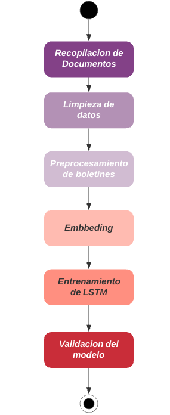

### Datos

#### Descripción del set de datos

Los boletines de prensa con los que se trabajo corresponden a tres momentos:

- Inicio de campaña.
- Primer debate.
- Segundo debate.

El set de datos cuenta con 347 boletines de prensa los cuales se obtuvieron de
sus fuentes oficiales:

- Enlace a los boletines
- Enlace a los boletines
- Enlace a los boletines

Para el candidato Andrés Manuel López Obrador de emitieron 83 boletines de
prensa.

Para el candidato Ricardo Anaya Cortés se emitieron 114 boletines de prensa.

Y para el candidato José Antonio Meade Kuribreña se emitieron 147 boletines de
prensa.

Los documentos en general cuentan con la siguiente estructura:

- Encabezado
- Sumario o Balazos
- _Lead_ o Primer Párrafo
- Cuerpo

#### Obtención de los datos

Para la obtención del set de datos se recurrió a dos medios:

- Solicitudes de transparencia
- Acceso a fuentes publicas (referidas en las respuestas a las solicitudes de
  transparencia)

Los documentos fueron originalmente entregados en formato .DOC en las solicitudes
de transparencia.

##### Candidato AMLO

- [Respuesta a solicitud de transparencia](./Corpus/AMLO/Respuesta2230000052819.md).
- Boletines
  - En formato doc, [aquí](./Corpus/AMLO/docs).
  - En web: [http://lopezobrador.org.mx/](http://lopezobrador.org.mx/)

##### Candidato JAMK

- [Respuesta a solicitud de transparencia](./Corpus/JAMK/RespTransparencia2237000009019_030519.md).
- Boletines
  - En formato doc, [aquí](./Corpus/JAMK/docs).
  - En web: [http://pri.org.mx/SomosPRI/saladeprensa/Categorias.aspx?y=3](http://pri.org.mx/SomosPRI/saladeprensa/Categorias.aspx?y=3).
- Boletines que no están como docx
  - [http://pri.org.mx/SomosPRI/SaladePrensa/Nota.aspx?y=30565](http://pri.org.mx/SomosPRI/SaladePrensa/Nota.aspx?y=30565)
  - [http://pri.org.mx/SomosPRI/SaladePrensa/Nota.aspx?y=30455](http://pri.org.mx/SomosPRI/SaladePrensa/Nota.aspx?y=30455)

##### Candidato RAC

- [Respuesta a solicitud de transparencia](./Corpus/RAC/Respuesta-73-19.md).
- Boletines
  - En formato doc, [aquí](./Corpus/RAC/docs).
  - En web: la cuenta [http://ricardoanaya.com.mx](http://ricardoanaya.com.mx) fue cerrada el 26 de marzo de 2019.

  

#### Limpieza de los datos

No es posible trabajar con los datos sin realizar la limpieza de estos, de modo que sólo
conservaremos las palabras relevantes en los formatos que busquemos y consideremos útiles.

Los documentos requirieron una limpieza de elementos no léxicos y correcciones de
formato para encabezados, sumarios y boletines en general (doble espacio, salto de línea,
acentos, etcétera). Para ésto, la tarea se segmentó en varios pasos:

- Se transformaron los documentos en formato .DOC a .TXT utilizando la
herramienta [pandoc](https://es.wikipedia.org/wiki/Pandoc).
- Se aplicaron los scripts de pre procesamiento y limpieza
  - **Pre procesamiento de Encabezados y Sumarios:** Se limpian los espacios y
  caracteres no léxicos (innecesarios) de los boletines en la BD.
  Jupyter notebook [aquí](./LimpiezaDeDatos/1_preprocesado_encabezados_sumarios.ipynb).
  - **Pre procesamiento de Boletines:** Se cambia el nombre de los archivos para que
  tengan el mismo formato. Además, se modifico el contenido de los boletines,
  quitando espacios dobles y más caracteres especiales, entre otros casos
  especiales en un par de boletines.
  Jupyter notebook [aquí](./LimpiezaDeDatos/2_preprocesar_boletines.ipynb).
  - **Emparejamiento de cada Encabezado con su Boletín:** Se emparejan los
  encabezados con el texto correspondiente a su boletín dentro de la BD. El
  formato final es internamente almacenado en CSV.
  Jupyter notebook [aquí](./LimpiezaDeDatos/3_emparejar_contenido_boletines.ipynb).
  - **Emparejamiento de Metadatos con su Boletín:** Se hace la busqué acera de los
  identificadores utilizados por los equipos de prensa para enumerar sus
  boletines/comunicados. Ésto es guardado en la BD.
  Jupyter notebook [aquí](./LimpiezaDeDatos/4_emparejar_metadatos.ipynb).
  - **Limpieza de Encabezados y Sumarios para cada Boletín:** Se elimina la
  información del contenido principal del archivo de la base de datos. Éstos
  ya se encuentran estructurados dentro de cada archivo, por lo que es
  innecesario retenerlos.
  Jupyter notebook [aquí](./LimpiezaDeDatos/5_eliminar_encabezado_sumarios.ipynb).

Una vez limpios los datos y almacenados en Mongo, la estructura de los datos era la siguiente:

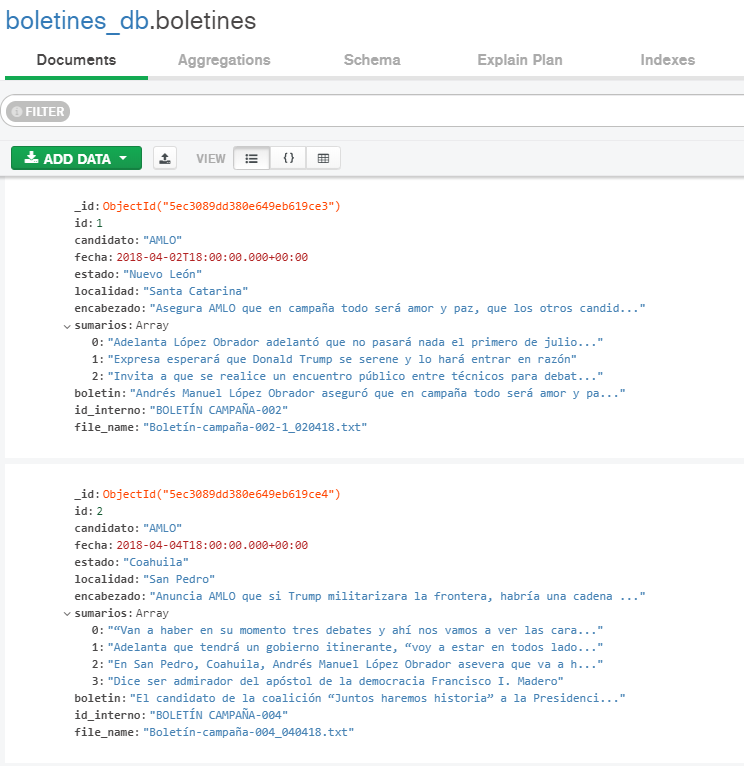

- **Tokenización de los datos:**
  Para la tokenización de datos, fueron utilizadas dos herramientas:

  * CoreNLP Stanza. Por la Universidad de Stanford.
  * Freeling. del centro de investigaciones TALP, por la Universidad Politécnica de Cataluña.

  Primeramente, CoreNLP Stanza permitió la tokenización del texto, etiquetar partes del discurso,
  y buscar entidades nombradas dentro de éste. Los tokens podemos dividirlos en sustantivos, verbos,
  puntuaciones, y entidades nombradas.
  El procedimiento tuvo que iterarse a lo largo de todos los boletines almacenados en la base de
  datos.

  Para terminar la etapa, utilizando Freeling (que ofrece corpus UNAM) se construyó una función
  para hacer una conexión con el servicio. De éste modo, se pudo obtener un diccionario con las
  oraciones etiquetadas, lematizadas y tokenizadas.

  Los notebooks correspondientes se encuentran [para Stanza aquí](./Tokenización/CoreNLP-Stanza/) y [para freeling aquí](./Tokenización/Freeling/).

Posterior a tokenizar la información el diagrama de la base de datos quedo de la siguiente manera:

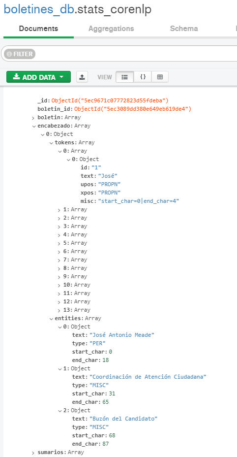

Datos en Core NLP.

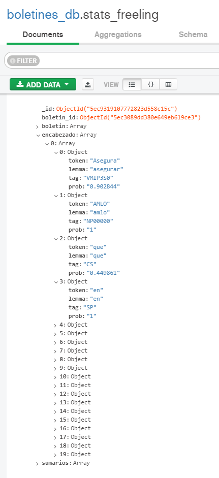

Datos en Freeling.

### Descripción de su método

Para poder hacer uso y obtener los resultados buscados dentro del proyecto, tuvimos que comenzar
proponiéndonos el método por el cuál realizaríamos la clusterización de nuestros datos. Sabemos
cómo obtenerlos y preprocesarlos. Lo que viene ahora, es el manejo de ellos para generar resultados.

#### LSTM en lugar de LDA

Inicialmente habíamos considerado utilizar LDA, sin embargo, nos pareció más útil recurrir
a un LSTM, que nos proporcionó más utilidad para el problema a resolver. LDA no fue del todo
inútil, pero su implementación no llegó a culminarse antes de decidir un cambio.
Comparado con un LSTM, ambos nos permiten etiquetar y clasificar, pero LDA se encontraba
más orientado a la generación de documentos basado en palabras y tópicos, mientras que LSTM,
mientras realiza algo similar, nos permite estar retroalimentándonos de estados anteriores
dentro de nuestros mismos documentos, por lo que, finalmente, fue la herramienta que utilizamos.

#### Embedding

De modo que, realizar embedding de palabras nos proporciona una representación mucho más profunda
acerca de cada una de ellas, decidimos utilizar ésta técnica por sobre la bolsa de palabras para
poder hacer clasificaciones más correctas.
Cada palabra quedaría dispuesta en un espacio vectorial donde cada vector representaría la pertenencia
de cada una de nuestras palabras con respecto a las categorías determinadas. La posición de cada uno
de nuestros vectores sería determinada y entrenada utilizando nuestro dataset de boletines políticos.

### Descripción del experimento

#### Embeddings

Para trabajar con el corpus, se decidió primeramente realizar los
embeddings del mismo.

El corpus consta de 6583 enunciados, de los cuales el enunciado más
pequeño cuenta con 3 tokens (palabras) y el más grande con 131 tokens. El
tamaño promedio de tokens en las oraciones fue de ~40 tokens y la desviación estándar de la cantidad de tokens del corpus fue de
~19 tokens.

El corpus utilizado para la parte de embeddings se extrajo
directamente desde Mongo, [aquí el script](./helpers/boletines.py).

El modelo utilizado fue:

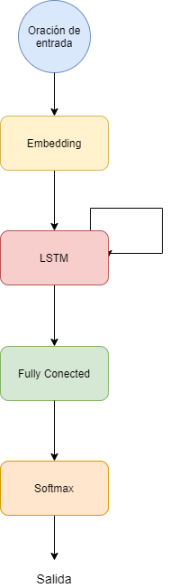

Modelo para los embeddings.

La idea del modelo utilizado fue lograr predecir la palabra
siguiente con el fin de crear los embeddings.

Para trabajar con el modelo se añadieron las etiquetas de inicio y
final de cadena, así como la etiqueta de "token desconocido" para
aquellas palabras que tuvieran una frecuencia de aparición menor a
dos en el corpus con el que se trabajo.

Los tokens resultantes se indexaron para trabajarlos de manera
numérica. Se utilizó 70% del corpus para entrenamiento
y 30% para la evaluación.

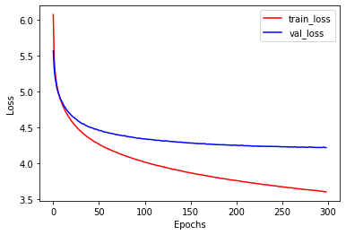

Resultados del modelo de embeddings.

El notebook para el entrenamiento del embedding se puede encontrar [aquí](./Embeddings/embeddings_train.ipynb).

[En este otro notebook](./Embeddings/test_model.ipynb) se puede
ver el uso de los embeddings para predecir la siguiente palabra,
permitiendo implementar dos modelos de generación de texto, uno
basado en la palabra que maximiza la probabilidad de salida en el
modelo, y otro basado en la probabilidad de la siguiente palabra.
Esto se realizo simplemente para verificar que los embeedings
generados eran correctos.

Los pesos de los embeddings generados fueron utilizados para
inicializar los pesos de la capa de embeddings del modelo de
clasificación.

Una visualización de los embeddings resultantes (como la
  mostrada en las imágenes) puede ser vista en [éste enlace](https://projector.tensorflow.org/?config=https://raw.githubusercontent.com/gandresto/APIT-2020-2/master/ProyectoFinal/projector_config.json)

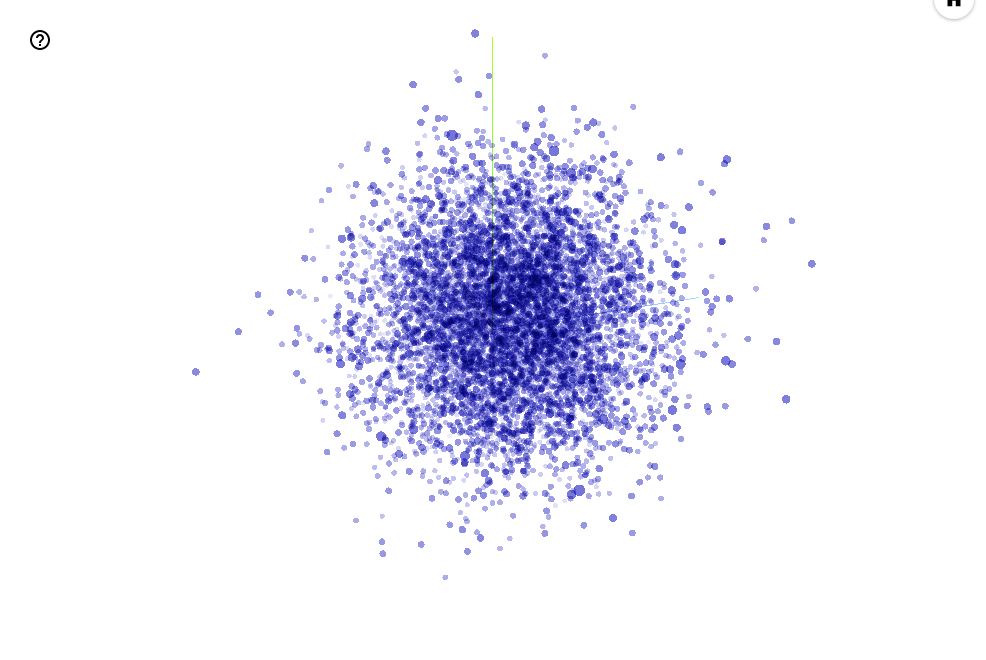

Nube de embeedings.

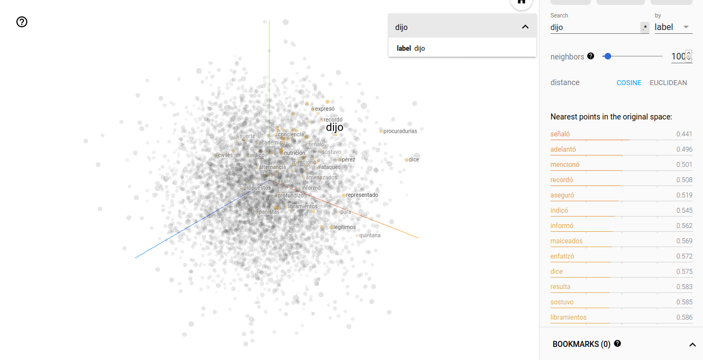

Nube de embeedings cercanos al token "dijo".

#### Etiquetado del set de datos para el clasificador

Del corpus se eligieron aleatoriamente 400 oraciones que se
etiquetaron manualmente con las categorías propuestas en la tesis
de referencia para el análisis persuasivo.

Estas son:

1. Construcción del emisor/candidato (C1)
2. Promesa de campaña (C2)
3. Construcción del adversario (E1)
4. Exageración de la información (E2)
5. Recurso retórico (E3)
6. Apelación al miedo (E4)
7. Llamado al voto (V1)

Las oraciones etiquetadas se pueden encontrar [aquí](./AnálisisPersuasivo/Corpus/Train/).

#### Clasificador

Con el corpus etiquetado con las categorías correspondientes se
entre el modelo del clasificador.

Para esto las oraciones se procesaron incluyendo las etiquetas de
inicio y final de oración, y la etiqueta de "token desconocido"
para los tokens con una frecuencia menor a dos en el corpus.

Los tokens se indexaron de manera numérica respetando los mismos
indices de las palabras que en el modelo de embeddings.

Para las categorías indicadas en el corpus etiquetado se
utilizó una matriz  `multi hot`, en el cual se representan las
posibles categorías a las que pertenece una oración.

~~~
Indice de categorías
{'C1': 0, 'C2': 1, 'E1': 2, 'E2': 3, 'E3': 4, 'E4': 5, 'V1': 6}

Categorías de ejemplo

[['C2'], ['NA'], ['C2'], ['E3', 'C1'], ['NA']]

Multi hot de las categorias de ejemplo

[[0, 1, 0, 0, 0, 0, 0],
 [0, 0, 0, 0, 0, 0, 0],
 [0, 1, 0, 0, 0, 0, 0],
 [1, 0, 0, 0, 1, 0, 0],
 [0, 0, 0, 0, 0, 0, 0]]
~~~

Con las clases identificadas en el corpus etiquetado se obtuvo la
matriz de correlación entre clases para entender su comportamiento
multi clase.

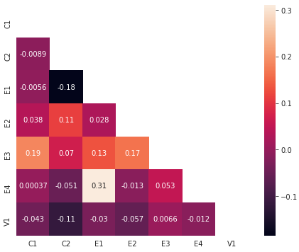

Matriz de correlación entre las clases.

Otro valor de referencia fue la probabilidad condicional entre
categorías para entender el comportamiento de estas, ya fuera
que hayan sido o no seleccionadas.

En las gráficas podemos observar las probabilidades condicionales
para todas las clases (C2, E1, E2, E3, E4, V1) siendo que la clase
C1 ya fue seleccionada (valor de 1) o no ha sido seleccionada
(valor de 0).

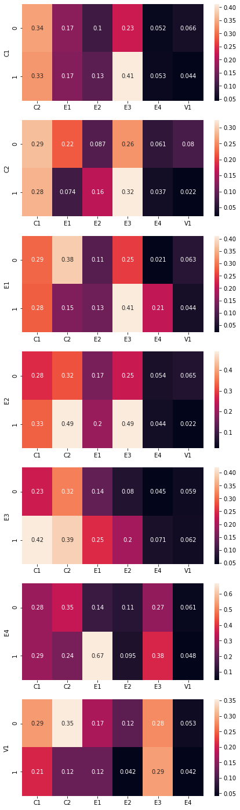

Probabilidad condicional entre clases.

El modelo de clasificación es similar al modelo de embedding con
la diferencia de que en este modelo se utilizó una Bi-LSTM
(la cual es bidireccional), su capa de salida es una función
sigmoide (en la anterior fue una softmax) y solamente se tomó en
cuenta la ultima salida de la secuencia de entrada (oración).

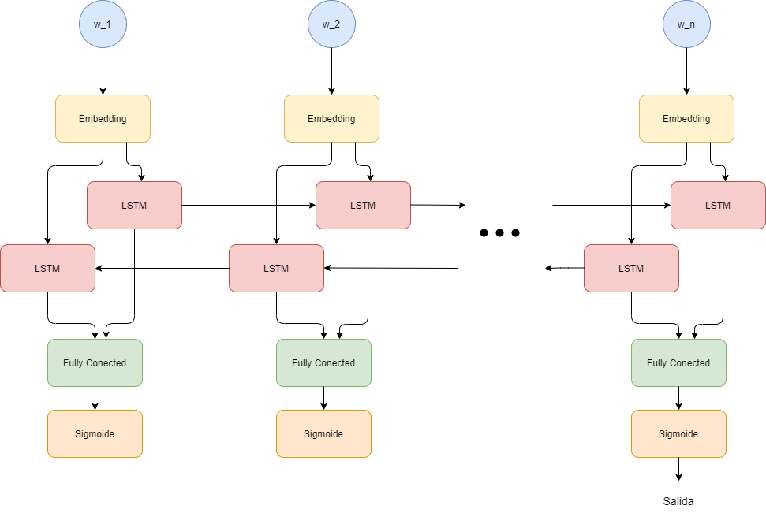

Modelo del clasificador.

El desempeño del modelo medido en función de la entropía cruzada
binaria es el siguiente.

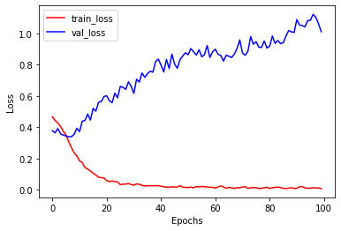

Entropía cruzada binaria del modelo de clasificación.

### Presentación de resultados

Como se pudo observar de la grafica de la entropía cruzada binaria
el modelo no generaliza, incluso, podríamos decir que hace un
sobre ajuste de las categorías en el corpus de evaluación.

El notebook con la etapa de evaluación se puede encontrar [aquí](./AnálisisPersuasivo/clasificador-test.ipynb).

Algunos de los resultados obtenidos se muestran a continuación
con su respectivo análisis.

~~~
==================================================
Describió que el de sus adversarios tienen que ver con las élites
del poder económico y del poder político y el proyecto de millones
de mexicanos es la transformación del país , por eso se logra la
unidad de todos los partidos , no es solo MORENA , el PT , el PES
, sino militantes de todos los partidos , porque solo el pueblo
unido y organizado puede salvar a la nación .

Categorías inferidas: C1

Probabilidades
C1    C2    E1    E2    E3    E4    V1
0.943    0.000    0.000    0.000    0.000    0.000    0.000
==================================================
~~~

La oración anterior construye a los candidatos colocándolos como una
oposición en contra de la ciudadanía. Genera una réplica a
el discurso de oposición desacreditando indirectamente a sus
propuestas basándose en los grupos a los que pertenezcan.

Por ésto, sería correcto etiquetar con un E1, sin embargo
lo que la red nos arrojó fue un C1. Muchos elementos en esta
oración se refieren a grupos de personas, y una cualidad de C1 es la pertenencia a grupos. Se entiende que la confusión pudo venir de ahí.

~~~
==================================================
Por la tarde , López Obrador estará Tecamachalco y Atlixco ,
Puebla .

Categorías inferidas: NA

Probabilidades
C1    C2    E1    E2    E3    E4    V1
0.004    0.000    0.001    0.000    0.000    0.000    0.025
==================================================
~~~

La red etiquetó la oración anterior de manera correcta.

La mayor probabilidad de categoría fue de V1, sin embargo
es una probabilidad descartable. La alta cantidad de entidades
nombradas, así como una carencia casi completa de verbos, pudo
haber orillado a la red a no concluir nada y etiquetar de la
manera esperada.

~~~
==================================================
Se comprometió a que la Secretaría de Comunicaciones y Transportes
estén en San Luis Potosí , porque se necesita reactivar la
economía en los estados , que no haya centralismo .

Categorías inferidas: C1

Probabilidades
C1    C2    E1    E2    E3    E4    V1
0.929    0.054    0.060    0.000    0.006    0.000    0.000
==================================================
~~~

La oración anterior debería poseer una etiqueta C2, debido a que es una
promesa de campaña, sin embargo, la red nos arrojó una etiqueta
C1, de construcción de candidato.

Otra de las cualidades dentro de C1 es la capacidad de colocarse
como una persona confiable y con capacidades de guiar a un país,
por lo que la confusión podría venir por la similitud y ambigüedad
que genera una promesa; mientras se promete hacer algo, se asegura
que existe poder personal (una construcción/autodenominación).

Promesa de campaña también podría vertirse dentro de la descripción
de las cualidades personales, cayendo erróneamente en C1.

~~~
==================================================
" Qué hicieron estos tecnócratas , acabaron la industria petrolera
, va a así en picada la industria petrolera , todavía en el 2004
la producción de petróleo era de 3 millones 400 mil barriles
diarios , ahora 2 millones 100 mil barriles diarios , más de un
millón de barriles diarios han dejado de producir tan solo en el
gobierno de Fox , de Calderón y de Peña Nieto " , dijo .

Categorías inferidas: C1, C2

Probabilidades
C1    C2    E1    E2    E3    E4    V1
0.999    0.962    0.000    0.006    0.089    0.000    0.000
==================================================
~~~

En la oración anterior la red nos arrojó dos resultados
incorrectos y no estuvo
cerca de etiquetar la categoría necesaria.
Por un lado, C1 y C2 hacen referencia hacia el mismo candidato.
Cuando se habla de otros, y mezclamos factores de aversión, la
etiqueta correcta sería E1 y E4, construcción del adversario y
apelación al miedo.

El error podría provenir del tipo de información. La red no entiende
en qué contexto se habla de cantidades; no hace una comparación.
Si abstraemos el problema, se tiene una oración con verbos como
"producir", "acabar", siendo que la red mayormente utiliza éstos para
prometer (producir empleos y acabar con la violencia/corrupción).

Hemos visto antes que existe confusión cuando hay promesas. La red
entiende una promesa como una exaltación de la persona, por lo que
se entiende que el error vino de los verbos y la falta de contexto por
parte de la red.

~~~
==================================================
Recordó que cuando fue jefe de Gobierno , llevó a cabo un programa
para construir 150 mil viviendas en la Ciudad de México y ahora
hará un programa de vivienda para ayudar a los afectados por el
sismo en este municipio .

Categorías inferidas: C2

Probabilidades
C1  C2  E1  E2  E3  E4  V1
0.003 0.999 0.000 0.004 0.000 0.000 0.000
==================================================
~~~

En la oración anterior la categoría entregada fue C2, siendo que la categoría
correcta debería ser C1 o ninguna.

La confusión viene dependiendo del intérprete. Al narrar una
actividad que sucedió en el pasado, se forja una construcción
personal del candidato, C1, pero la condición que se busca, es
pertenecer a un grupo (que no sucede) o la utilización de palabras
que autodeterminen (que tampoco ocurre).

Al hablar de resultados, se podría confundir con hablar de promesas;
'construir', 'hará', 'ayudar', generan un contexto donde las palabras
que rigen al tópico se ligan con palabras encontradas en C2.

## Conclusión

Los resultados del modelo pudieron verse sesgados por la cantidad
de elementos del corpus (era un corpus pequeño) y la posibilidad
de que una oración fuese multiclase.

Debido a la cantidad de trabajo que se realizo durante este
proyecto pudimos utilizar diversas herramientas que consideramos
nos dejan un gran aprendizaje.

Si bien los resultados obtenidos por el enfoque que se utilizó no
consideramos que fueran los mejores, creemos que nos da pie a
entender mejor los problemas que requieren clasificación multiclase
y nos da ideas para proponer otros abordajes.

También intuimos que el set de datos, al estar acotado en un solo
contexto, pudo haber estado sesgado al no tener variedad de temas
que permitieran identificar claramente las clases. Por el contenido
semántico de las oraciones era complicado identificar las
categorías de manera sencilla.

### Trabajo futuro

- Utilizar otro modelo de embedding como Word2Vec
- Utilizar modelos basados en transformers como BERT o ELMo
- Tener un conjunto de datos mas robustos, tal vez con más etiquetado
- Refinar las condiciones entre categorías
- Generalizar el corpus con boletines de campaña de otros años y otras elecciones para incrementar tu tamaño y que no tenga un sesgo.

<!-- Profe, Si encuentra éste mensaje le disparamos el Soundtrack de su anime favorito uwu , escribanos un tuit a @_penserbjorne @mauevaz @gandresto  -->
